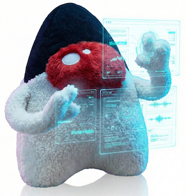

[](https://jitpack.io/#umjammer/vavi-awt)
[](https://github.com/umjammer/vavi-awt/actions/workflows/maven.yml)
[](https://github.com/umjammer/vavi-awt/actions/workflows/codeql-analysis.yml)


# vavi-awt



🖥️ awt, swing helpers

## Install

* [maven](https://jitpack.io/#umjammer/vavi-awt)

## Usage

### 🎨 Contents

#### 🖌️ easy swing binding system

auto wiring between a bean and swing components

[sample](src/test/java/vavi/swing/binder/BinderTest.java)

#### 🖌️ easy drag and drop system

make a component droppable by one liner

```java
    Droppable.makeComponentSinglePathDroppable(component, p -> { ... });
```

#### 🖌️ rubber band selection

an ordinary gui bound selector

[sample](https://github.com/umjammer/vavi-image-sandbox/tree/master/src/test/java/Test32.java)

#### 🖌️ JImageComponent

an image component which has auto size adjustment and keeping aspect ratio

[sample](src/test/java/JImageComponentTest.java)

#### 🖌 JHistoryComboBox

a text field with history dropdown (`ctrl + DELETE` (mac: `ctrl + fn + delete`) on the dropdown list removes the item)

[sample](src/test/java/FileRenamer.java)

#### 🖌 JFileChooserHistoryComboBox

a file name field with history dropdown and the file chooser button

[sample](https://github.com/umjammer/vavi-apps-jwindiff)

## References

 * JSR 295
   * https://news.mynavi.jp/techplus/article/jsr-10/

## TODO

 * renamer
   * regex match global
   * ~~history saving is not stable~~
   * ~~history duplication~~
 * on macos 13.5.2 on `renamer` period '.' is not rendered with Oracle (8) and Open JDK (21).
   * with Jetbrain's JDK (17) is OK
   * [reproducer](src/test/java/IdeTest.java#period) couldn't reproduce now

---

<sub>image designed by @umjammer, drawn by nano banana</sub>
